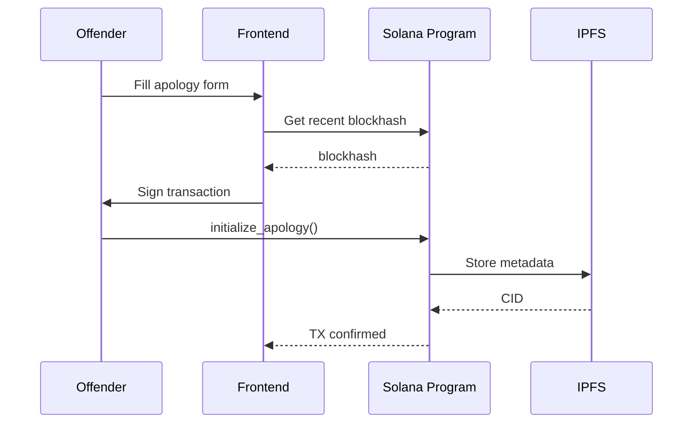

# ApologyStake : Tokenized Apology Protocol (TAP) - Technical Specification

## Table of Contents

1. [Core Features](#core-features)
2. [System Components](#system-components)
3. [Smart Contract Functions](#smart-contract-functions)
4. [Frontend Pages & Components](#frontend-pages--components)
5. [Backend API Endpoints](#backend-api-endpoints)
6. [Social Media Integration Details](#social-media-integration-details)
7. [Data Models](#data-models)
8. [Sequence Diagrams](#sequence-diagrams)
9. [Error Handling](#error-handling)
10. [Audit & Monitoring](#audit--monitoring)

## Core Features

### 1. Apology Creation & Staking

#### Offender Flow:

- Connect Phantom Wallet
- Input Fields:
  - Victim's Wallet Address
  - Probation Period (7/30/90 days)
  - Stake Type (SOL or NFT)
  - Apology Message (text/JSON metadata)
- Sign Transaction:
  - SOL: Transfer to PDA Escrow
  - NFT: Transfer to PDA via SPL Token Program
- Mint Apology NFT:
  - Metadata stored on IPFS (using NFT.Storage)
  - NFT contains:
    - Original apology text
    - Stake details
    - Contract address

### 2. Victim Resolution Workflow

#### Actions:

- `Release Stake`: Return funds to offender after probation
- `Claim Stake`: Take ownership of staked assets

#### Conditions:

- Victim must sign transaction
- Probation period must have elapsed (checked via Solana Clock)
- Contract must be in `ACTIVE` state

### 3. Social Accountability

#### Tokenized Apology NFT:

- Embedded "View Apology" link
- Verifiable on Solana explorers
- Auto-post to Twitter via API (opt-in)

#### Reputation Tracker:

- Public dashboard showing:
  - Total apologies created
  - Success/failure rate
  - Historical stakes

## System Components

### 1. Solana Program (Anchor)

| Component        | Description                                   |
| ---------------- | --------------------------------------------- |
| `ApologyAccount` | PDA storing apology state (8 bytes + dynamic) |
| `Escrow`         | PDA holding SOL/NFTs (owned by program)       |
| `Error Codes`    | Custom errors (e.g., `ProbationNotOver`)      |

### 2. Frontend (Next.js)

| Page            | Components                                    |
| --------------- | --------------------------------------------- |
| `/create`       | Wallet connector, stake form, NFT preview     |
| `/dashboard`    | Active apologies table, filter by status      |
| `/apology/[id]` | Apology details, countdown timer, action CTAs |
| `/twitter-auth` | OAuth 2.0 flow for Twitter integration        |

### 3. Backend Services

| Service       | Tech Stack             | Purpose                   |
| ------------- | ---------------------- | ------------------------- |
| API Server    | Next.js API Routes     | Bridge frontend ↔ Solana |
| IPFS Uploader | NFT.Storage SDK        | Store apology metadata    |
| Twitter Bot   | Twitter API v2 + OAuth | Auto-post NFTs            |

## Smart Contract Functions

### 1. `initialize_apology`

#### Parameters:

- `offender: Pubkey` (signer)
- `victim: Pubkey`
- `probation_days: u64`
- `stake_amount: u64` (lamports)
- `nft_mint: Option<Pubkey>` (if NFT stake)

#### Logic:

- Create `ApologyAccount` PDA
- Transfer SOL/NFT to escrow PDA
- Set probation end = current slot + (probation_days \* slots_per_day)

#### Errors:

- `InsufficientFunds`: Offender balance < stake_amount
- `InvalidNFTTransfer`: NFT not owned by offender

### 2. `release_stake`

#### Parameters:

- `victim: Pubkey` (signer)
- `apology_account: Pubkey`

#### Checks:

- Current slot > probation_end
- `apology_account.status == Active`

#### Actions:

- Transfer SOL/NFT from escrow → offender
- Update status → `Completed`

### 3. `claim_stake`

#### Parameters:

Same as `release_stake`

#### Actions:

- Transfer SOL/NFT → victim
- Burn Apology NFT (if applicable)

## Frontend Pages & Components

### 1. `/create` Page

#### Step 1: Wallet Connection

- Uses `@solana/wallet-adapter-react`

#### Step 2: Stake Details

- SOL Input (converted to lamports)
- NFT Selector (fetches user's SPL tokens)

#### Step 3: Preview & Sign

- Shows estimated gas fee
- Renders apology NFT preview

### 2. `/dashboard` Page

#### Filters:

- `Status`: Active/Completed
- `Stake Type`: SOL/NFT

#### Columns:

- Date Created
- Victim Address (truncated)
- Probation End Date
- Stake Amount
- Actions (View/Share)

### 3. `/apology/[id]` Page

#### Dynamic Data:

- Fetches apology state from chain
- Countdown timer (if probation ongoing)

#### Action Buttons:

- `Release Stake`: Only visible to victim post-probation
- `Claim Stake`: Same as above
- `Share on Twitter`: Links to pre-filled tweet

## Backend API Endpoints

### 1. `POST /api/apology/create`

#### Request:

```json
{
  "offender": "Fzv5k...",
  "victim": "Hx8d...",
  "probationDays": 30,
  "stakeAmount": 1.5,
  "nftMint": null
}
```

#### Response:

```json
{
  "txId": "5bz1...",
  "apologyId": "abc-123",
  "nftUrl": "ipfs://bafy..."
}
```

### 2. `GET /api/apology/:id`

#### Response:

```json
{
  "status": "ACTIVE",
  "stakeAmount": 1500000000,
  "probationEnd": "2023-10-05T00:00:00Z",
  "nftMetadata": {
    /* IPFS JSON */
  }
}
```

### 3. `POST /api/twitter/post`

#### Request:

```json
{
  "apologyId": "abc-123",
  "accessToken": "tw_123..."
}
```

#### Response:

```json
{
  "tweetId": "1678..."
}
```

## Data Models

### 1. Solana Account Layout (Anchor)

```rust
#[account]
pub struct ApologyAccount {
    pub offender: Pubkey,      // 32
    pub victim: Pubkey,        // 32
    pub probation_end: i64,    // 8
    pub stake_amount: u64,     // 8
    pub nft_mint: Option<Pubkey>, // 33 (1 + 32)
    pub status: ApologyStatus, // 1
    // Total: 114 bytes
}

#[derive(AnchorSerialize, AnchorDeserialize)]
pub enum ApologyStatus {
    Active,
    Completed,
}
```

### 2. Database Schema (Prisma)

```prisma
model User {
  id           String    @id @default(uuid())
  wallet       String    @unique
  createdAt    DateTime  @default(now())
  apologies    Apology[]
  twitterId    String?   @unique
}

model Apology {
  id             String        @id @default(uuid())
  offender       User          @relation(fields: [offenderId], references: [id])
  offenderId     String
  victimWallet   String
  contractAddr   String        @unique
  stakeAmount    Int          // lamports
  nftCID         String?      // IPFS CID
  probationDays  Int
  status         ApologyStatus @default(ACTIVE)
  createdAt      DateTime      @default(now())
}
```

## Sequence Diagrams

### Apology Creation



## Error Handling

### Contract Errors

| Error Code       | Scenario                          |
| ---------------- | --------------------------------- |
| NotVictim        | Wrong signer for release/claim    |
| ProbationOngoing | Victim acts before probation ends |
| InvalidStake     | NFT not transferred properly      |

### API Errors

```json
{
  "error": "INSUFFICIENT_FUNDS",
  "message": "Add 0.05 SOL to your wallet",
  "required": 50000000,
  "available": 30000000
}
```
