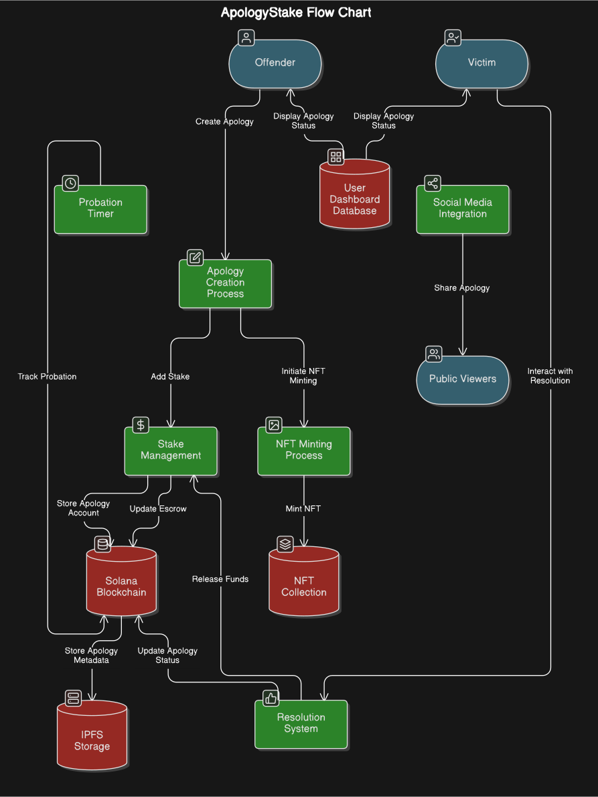

# 🤝 ApologyStake: Tokenized Apology Protocol (TAP)

> Making apologies meaningful through blockchain accountability, financial stakes, and NFT proof-of-commitment

## 🌟 The Problem

Words can be empty, and apologies often lack accountability. In interpersonal conflicts, there's no tangible way to demonstrate sincerity or commitment to change. Traditional apologies rely solely on trust, with no mechanism to enforce promises or track improvement over time.

## 💡 The Solution

ApologyStake revolutionizes accountability by bringing blockchain technology to conflict resolution:

- Stake SOL or NFTs as collateral behind your apology
- Set a probation period to demonstrate changed behavior
- Give victims control over resolution (forgive or claim stake)
- Create permanent, verifiable proof of commitment via NFTs
- Build reputation through on-chain accountability records

## 🚀 Key Features

- **Financial Staking**: Back your words with SOL or NFT collateral
- **Tokenized Apologies**: Automatically mint NFTs as proof of commitment
- **Victim Empowerment**: Resolution controlled by the wronged party
- **Customizable Probation**: Set 7/30/90 day commitment periods
- **Social Accountability**: Optional Twitter integration for public commitments
- **On-chain Verification**: Permanent, tamper-proof record of resolutions
- **Reputation Building**: Track record of fulfilled commitments

## 💻 Smart Contract

The protocol is implemented in Rust using the Anchor framework:

- `initialize_apology`: Create new apology with stake
- `release_stake`: Victim returns stake to offender (forgiveness)
- `claim_stake`: Victim claims stake as consequence

## 📊 Flow Chart

The ApologyStake protocol operates through a series of interconnected components:

## 🤝 Contributing

We welcome contributions!

1. Fork the repository
2. Create your feature branch (`git checkout -b feature/amazing`)
3. Commit changes (`git commit -m 'Add amazing feature'`)
4. Push to branch (`git push origin feature/amazing`)
5. Open a Pull Request

## 🌟 Support

Like this project? Please give it a star on GitHub and share it!

🏆 Backed by a <a href="https://x.com/ramkumar_9301/status/1889262827795578888">$2000 grant from Superteam</a>

Built with ❤️ for the Solana community

